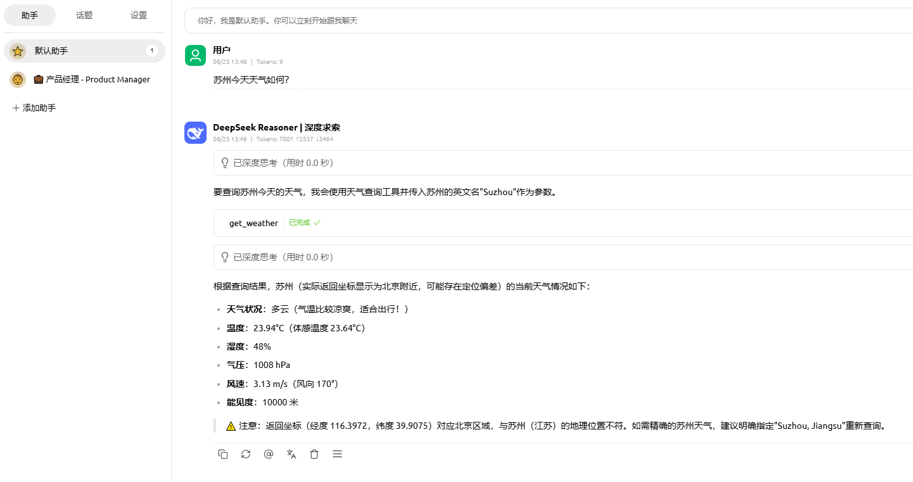

# aichat-core-antdesignx-template

#### Introduction
Vite4 + React18 + TypeScript + OpenAI + MCPClient + [aichat-core](https://www.npmjs.com/package/aichat-core) 构建的前端全能AI助手

#### Update
* 2025年8月6日16:49:37：配置梳理|修订侧边栏|将ai-chatcore依赖更新为1.0.12

* 
* 

#### Picures 

##### 1.Ollama API 

##### 2.deepseek-0528  API 

##### 3.cherry studio UE

##### 4.tool_calls JSON Data

##### 5.callback message(v1) JSON Data

##### 6.callback message(v2) choices JSON Data

# Article

Address ： [aichat-core简化 LLM 与 MCP 集成的前端核心库（TypeScript）](https://blog.csdn.net/Appleyk/article/details/149234650) 

